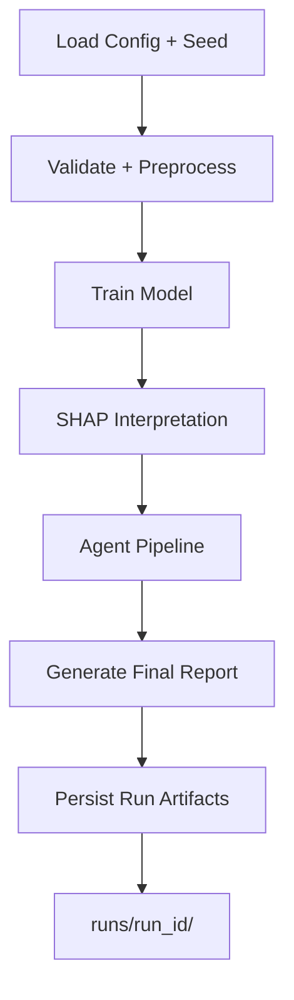

# OmniInsight

OmniInsight is a modular AI analysis platform for tabular and multi-omics workflows.
It runs end-to-end:

1. Data validation
2. Auto preprocessing (imputation, scaling, one-hot encoding, split)
3. Model training (XGBoost or PyTorch DNN with early stopping)
4. SHAP feature attribution
5. Agent-driven structured report generation
6. Experiment tracking and reproducibility artifact storage

## Project Structure

```text
OmniInsight/
├── core/
├── adapters/
├── interpretation/
├── agents/
├── dashboard/
├── config/
├── data/
└── main.py
```

## Experiment Workflow



## Reproducibility

- Global seed is applied to `random`, `numpy`, and `torch` (if available).
- Train/test split uses the seeded random state.
- Config hash (`SHA256`) is computed from the config file and saved per run.
- Effective adapter/model hyperparameters are snapshotted in each run.
- `--from-run {run_id}` replays a saved run configuration.

## Installation

```bash
pip install -r OmniInsight/requirements.txt
```

## CLI Demo (example_dataset.csv)

```bash
python OmniInsight/main.py \
  --data OmniInsight/data/example_dataset.csv \
  --config OmniInsight/config/model_config.yaml \
  --model-type xgboost \
  --seed 42
```

Run with DNN:

```bash
python OmniInsight/main.py \
  --data OmniInsight/data/example_dataset.csv \
  --model-type dnn \
  --seed 42
```

Re-run from a previous run:

```bash
python OmniInsight/main.py --from-run 20260227_230000_123456_xgboost
```

## Example Run Directory

```text
runs/20260227_230000_123456_xgboost/
├── config_snapshot.yaml
├── config_model_snapshot.yaml
├── config_hash.txt
├── model_hyperparameters.yaml
├── metrics.json
├── top_features.json
├── agent_outputs.json
├── final_report.json
└── model.json (or model.model / model.pt)
```

## Streamlit Dashboard

```bash
streamlit run OmniInsight/dashboard/app.py
```

In the dashboard you can upload any CSV, choose target/task/model, and execute the full pipeline.

## OpenAI Agent Behavior

- If `OPENAI_API_KEY` is set, agents call OpenAI and return JSON outputs.
- If no API key is set, agents return deterministic structured mock outputs.

## Bio AI Extension

OmniInsight includes a Bio AI extension that mimics AI-driven biological insight pipelines:

- Multi-omics schema ingestion across transcriptomics, proteomics, and metabolomics files.
- Sample-wise merge using a shared sample ID to build unified training matrices.
- Feature block tracking per omics layer to preserve modality provenance.
- Gene/protein/metabolite-to-pathway abstraction using deterministic pathway mapping.
- Pathway-level importance aggregation from model feature importance outputs.
- Biological insight abstraction including:
  - top regulatory genes
  - dominant pathways
  - candidate bioengineering targets
  - hypothesis statements for follow-up experiments

Run Bio mode by providing one or more omics blocks:

```bash
python OmniInsight/main.py \
  --data OmniInsight/data/bio_base_dataset.csv \
  --transcriptomics OmniInsight/data/transcriptomics.csv \
  --proteomics OmniInsight/data/proteomics.csv \
  --metabolomics OmniInsight/data/metabolomics.csv \
  --sample-id-col sample_id \
  --target-column target \
  --use-bio-adapter
```
